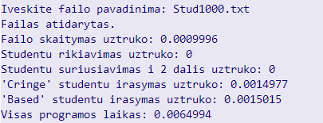
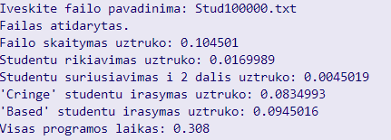
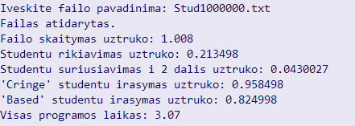
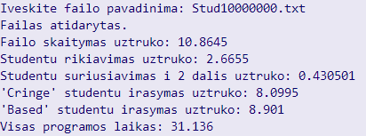

# ObjektinioProgramavimo_uzd
## Failų skaitymo greičiai
* 1000 studentų su 7 namų darbų pažymiais

* 10000 studentų su 7 namų darbų pažymiais

* 100000 studentų su 7 namų darbų pažymiais

* 1000000 studentų su 7 namų darbų pažymiais

* 10000000 studentų su 7 namų darbų pažymiais

## Failų kūrimo greičiai
* 1000 studentų su 7 namų darbų pažymiais

* 10000 studentų su 7 namų darbų pažymiais

* 100000 studentų su 7 namų darbų pažymiais

* 1000000 studentų su 7 namų darbų pažymiais

* 10000000 studentų su 7 namų darbų pažymiais

